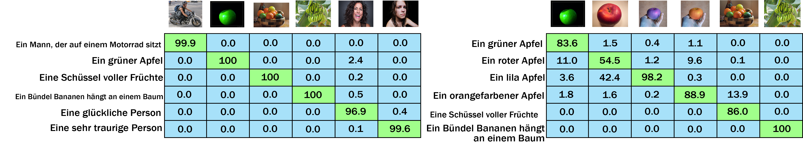

<br />
<p align="center">
  <h1 align="center">M-BERT Base 69</h1>
  
  <p align="center">  
    <a href="https://huggingface.co/M-CLIP/M-BERT-Base-69">Huggingface Model</a>
    ·
    <a href="https://huggingface.co/bert-base-multilingual-cased">Huggingface Base Model</a>
  </p>
</p>

## Usage
To use this model along with the original CLIP vision encoder follow the [main page usage instructions](https://github.com/FreddeFrallan/Multilingual-CLIP) to download the additional linear weights.
Once this is done, you can load and use the model with the following code
```python
from src import multilingual_clip

model = multilingual_clip.load_model('M-BERT-Base-69')
embeddings = model(['Älgen är skogens konung!', 'Wie leben Eisbären in der Antarktis?', 'Вы знали, что все белые медведи левши?'])
print(embeddings.shape)
# Yields: torch.Size([3, 640])
```

<!-- ABOUT THE PROJECT -->
## About
A [bert-base-multilingual](https://huggingface.co/bert-base-multilingual-cased) tuned to match the embedding space for 69 languages, to the embedding space of the CLIP text encoder which accompanies the Res50x4 vision encoder. <br>
A full list of the 100 languages used during pre-training can be found [here](https://github.com/google-research/bert/blob/master/multilingual.md#list-of-languages), and a list of the 69 languages used during fine-tuning can be found in [SupportedLanguages.md](Fine-Tune-Languages.md).

Training data pairs was generated by sampling 40k sentences for each language from the combined descriptions of [GCC](https://ai.google.com/research/ConceptualCaptions/) + [MSCOCO](https://cocodataset.org/#home) + [VizWiz](https://vizwiz.org/tasks-and-datasets/image-captioning/), and translating them into the corresponding language.
All translation was done using the [AWS translate service](https://aws.amazon.com/translate/), the quality of these translations have currently not been analyzed, but one can assume the quality varies between the 40 languages.

<!---
## Evaluation
A non-rigorous qualitative evaluation shows that for the languages French, German, Spanish, Russian, Swedish and Greek it seemingly yields respectable results for most instances. The exception being that Greeks are apparently unable to recognize happy persons. <br>
When testing on Kannada, a language which was included during pre-training but not fine-tuning, it performed close to random

<!---
The qualitative test was organized into two sets of images and their corresponding text descriptions. The texts were manually translated into each different test languages, where the two sets include the following images:
#### Set Nr 1
* A man on a motorcycle
* A green apple
* A bowl of fruits
* A bunch of bananas hanging from a tree
* A happy person laughing/smiling
* A sad person crying
#### Set Nr 2
The second set included only images of fruits, and non-realistic photoshopped images, in an attempt to increase the difficulty.
* A green apple
* A red apple
* A purple apple (photoshopped)
* A orange apple (photoshopped)
* A bowl of fruits
* A bunch of bananas hanging from a tree

<!---
### Results
The results depicted below are formatted so that each <b>column</b> represents the Softmax prediction over all the texts given the corresponding image. The images and matchings texts are ordered identically, hence a perfect solution would have 100 across the diagonal.

<!---
#### French

#### German

#### Spanish

#### Russian

#### Swedish

#### Greek

#### Kannada
Kannada was <b>not included</b> in the 40 fine-tuning languages, but included during language modelling pre-training

