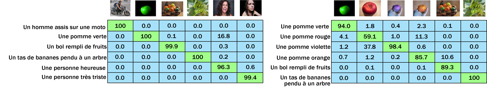
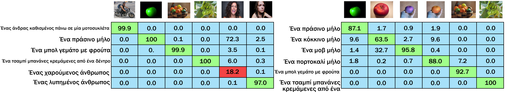
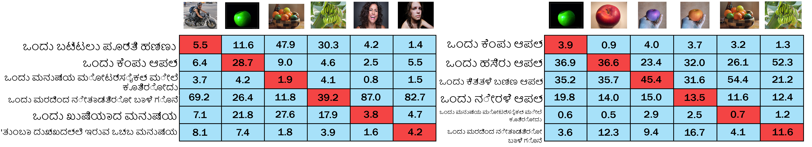

 

  <h1 align="center">M-BERT Distil 40</h1>
  
  
  
    <a href="https://huggingface.co/M-CLIP/M-BERT-Distil-40">Huggingface Model</a>
    ·
    <a href="https://huggingface.co/distilbert-base-multilingual-cased">Huggingface Base Model</a>
  

<!-- ABOUT THE PROJECT -->
## About
A [distilbert-base-multilingual](https://huggingface.co/distilbert-base-multilingual-cased) tuned to match the embedding space for 40 languages, to the embedding space of the CLIP text encoder which accompanies the Res50x4 vision encoder.  
A full list of the 100 languages used during pre-training can be found [here](https://github.com/google-research/bert/blob/master/multilingual.md#list-of-languages), and a list of the 40 languages used during fine-tuning can be found in [SupportedLanguages.md](Fine-Tune-Languages.md).

Training data pairs was generated by sampling 40k sentences for each language from the combined descriptions of [GCC](https://ai.google.com/research/ConceptualCaptions/) + [MSCOCO](https://cocodataset.org/#home) + [VizWiz](https://vizwiz.org/tasks-and-datasets/image-captioning/), and translating them into the corresponding language.
All translation was done using the [AWS translate service](https://aws.amazon.com/translate/), the quality of these translations have currently not been analyzed, but one can assume the quality varies between the 40 languages.

## Evaluation
A non-rigorous qualitative evaluation shows that for the languages French, German, Spanish, Russian, Swedish and Greek it seemingly yields respectable results for most instances. However, it was found that Kannada performed close to random, although it was included during fine-tuning.

The qualitative test was organized into two sets of images and their corresponding text descriptions. The texts were manually translated into each different test languages, where the two sets include the following images:
#### Set Nr 1
* A man on a motorcycle
* A green apple
* A bowl of fruits
* A bunch of bananas hanging from a tree
* A happy person laughing/smiling
* A sad person crying
#### Set Nr 2
The second set included only images of fruits, and non-realistic photoshopped images, in an attempt to increase the difficulty.
* A green apple
* A red apple
* A purple apple (photoshopped)
* A orange apple (photoshopped)
* A bowl of fruits
* A bunch of bananas hanging from a tree

### Results
The results depicted below are formatted so that each <b>column</b> represents the Softmax prediction over all the texts given the corresponding image. The images and matchings texts are ordered identically, hence a perfect solution would have 100 across the diagonal.

#### French

#### German

#### Spanish

#### Russian

#### Swedish

#### Greek

#### Kannada

